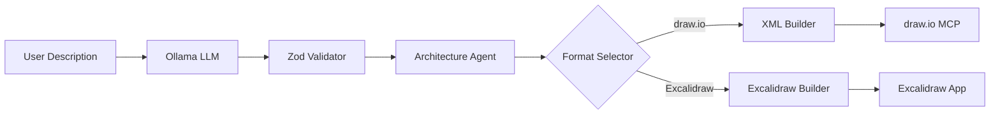

<div align="center">
  
  <h1>SketchStack ⚡</h1>
  <p>
    <strong>AI-Powered Architecture Diagram Generator</strong>
  </p>
  <p>
    Turn natural language descriptions into professional <code>draw.io</code> or hand-drawn <code>Excalidraw</code> diagrams in seconds.<br>
    Powered by <strong>Ollama</strong> (Llama 3.2), <strong>draw.io MCP Server</strong>, and <strong>Excalidraw</strong>.
  </p>
</div>


---

## 🎯 What It Does

1. **Describe** your system in plain English.
2. **AI extracts** components, relationships, data flows, and architecture style.
3. **Diagram is generated** in your preferred format:
    - **draw.io**: Professional, standard XML with cloud icons.
    - **Excalidraw**: Hand-drawn style, perfect for drafting and prototyping.
4. **Interactive Mode**: Expand Excalidraw diagrams to fullscreen for drag-and-drop editing.
5. **Refine** iteratively — "Add caching", "Make it serverless", etc.


---

## 🎨 Excalidraw Support

SketchStack now supports **Excalidraw** for a sketch-style aesthetic. 
- **Auto-Layout**: Uses `dagre` for smart hierarchical positioning.
- **Interactive**: Toggle fullscreen to drag, move, and organize nodes.
- **Hand-Drawn**: Great for high-level system design and whiteboard sessions.

---

## 📐 Architecture



---

## 🚀 Quick Start

### Prerequisites

1. **Node.js 18+** — [Download](https://nodejs.org/)
2. **Ollama** — [Install](https://ollama.com/download)

### Setup

```bash
# 1. Clone this repo
git clone https://github.com/harishkotra/SketchStack SketchStack
cd SketchStack

# 2. Install dependencies
npm install

# 3. Pull an Ollama model
ollama pull llama3.2
# or: ollama pull qwen2.5-coder

# 4. Start Ollama (if not already running)
ollama serve

# 5. Start SketchStack
npm run dev

# 6. Open http://localhost:3000
```

---

## 📖 Use Cases

- **DevRel Demos**: Quickly generate reference architectures for blog posts or documentation.
- **System Design Interviews**: Practice designing systems and visualizing them instantly.
- **Prototyping**: Brainstorm architecture ideas and iterate rapidly before committing to code.
- **Documentation**: Generate starting-point diagrams for existing legacy systems by describing them.
- **Teaching**: Show students how different components (load balancers, caches, queues) fit together.

---

## 🌐 Public API

SketchStack exposes a REST API that you can use in your own applications. The server has CORS enabled by default.

### Endpoint: `POST /api/generate`

**Request:**
```json
{
  "description": "A microservice e-commerce backend with API gateway",
  "cloudProvider": "aws",       // optional: aws, gcp, azure, neutral
  "architectureStyle": "auto"   // optional: microservices, serverless, etc.
}
```

**Response:**
```json
{
  "sessionId": "session_123",
  "xml": "<mxGraphModel>...</mxGraphModel>",
  "drawioUrl": "https://app.diagrams.net/...",
  "viewerUrl": "https://viewer.diagrams.net/..."
}
```

### Deployment

**Docker**:
```bash
docker build -t sketchstack .
docker run -p 3000:3000 -e OLLAMA_URL=http://host.docker.internal:11434 sketchstack
```

**Vercel / Railway**:
- This project requires a persistent server (Node.js) and access to Ollama.
- For serverless deployments, you'll need a public Ollama endpoint (e.g., via ngrok or a hosted LLM API).
- Set `FORCE_COLOR=1` for better log readability.

---

## 🧱 Project Structure

| File | Purpose |
|------|---------|
| `index.js` | Express entry point & CORS config |
| `config.js` | Configuration (Ollama, layout, CORS) |
| `server/agents/` | AI logic for extraction & refinement |
| `server/diagram/` | XML builder, layout engine, cloud icons |
| `server/mcp/` | draw.io MCP client integration |
| `public/` | Premium dark-mode UI |
